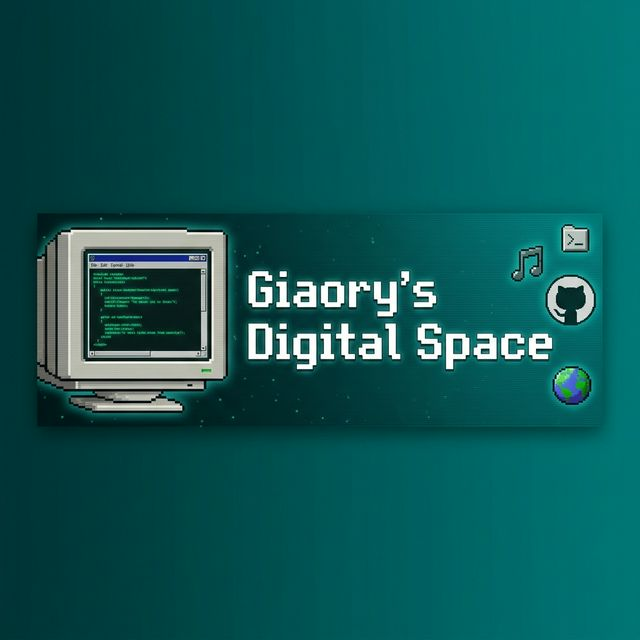
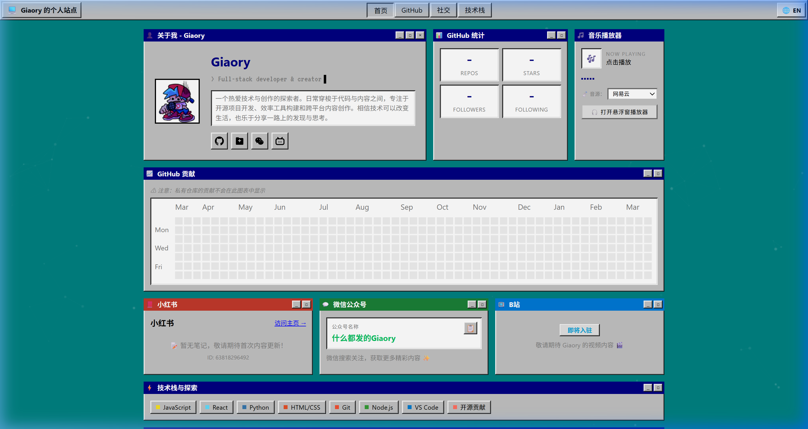
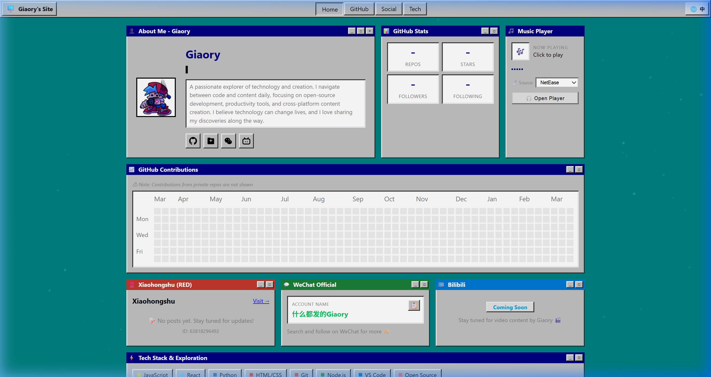
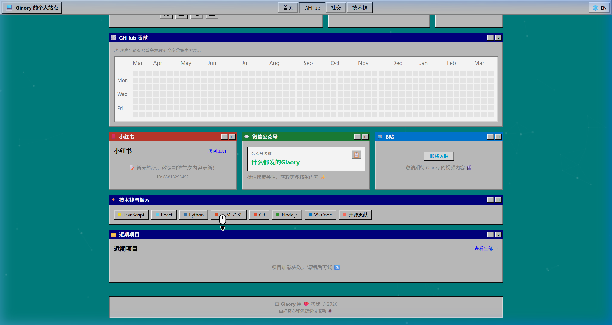

<p align="center">
  
</p>

<h1 align="center">🖥️ Giaory's Digital Space | Giaory 的数字空间</h1>

<p align="center">
  <strong>A retro Windows 95-themed personal website built with pure HTML, CSS & JavaScript.</strong><br/>
  <strong>一个以 Windows 95 复古风格打造的个人站点，使用纯 HTML、CSS 和 JavaScript 构建。</strong>
</p>

<p align="center">
  <a href="https://giaory.pages.dev">🌐 Live Demo</a> •
  <a href="#features--特性">✨ Features</a> •
  <a href="#tech-stack--技术栈">🛠️ Tech Stack</a> •
  <a href="#screenshots--截图展示">📸 Screenshots</a>
</p>

---

## Hey there! 👋 | 你好！👋

Welcome to my digital corner of the internet! This is my personal portfolio website, designed with a nostalgic Windows 95 aesthetic — complete with draggable-looking title bars, pixel-art icons, and that classic teal desktop we all know and love. 💾✨

欢迎来到我的互联网数字角落！这是我的个人站点，采用了怀旧的 Windows 95 美学设计——拥有经典的窗口标题栏、像素风图标，以及我们熟悉又怀念的青绿色桌面。💾✨

## Features | 特性 ✨

This isn't just a static page — it's a fully interactive experience:

这不只是一个静态页面——而是一个完整的交互体验：

- **🎨 Bento Grid Layout**: A modern card-based layout that organizes content into a beautiful, responsive grid.
- **🎨 Bento 网格布局**：现代卡片式布局，将内容组织成美观且响应式的网格。

- **🌐 Bilingual Support (中/EN)**: Full internationalization — toggle between Chinese and English with a single click. Every piece of text adapts instantly.
- **🌐 双语支持（中/EN）**：完整的国际化功能——一键切换中英文，所有文字即时变更。

- **📊 GitHub Stats Integration**: Real-time display of repos, stars, followers, and a contribution heatmap — all fetched through a smart caching layer to avoid API rate limits.
- **📊 GitHub 数据集成**：实时展示仓库数、Star 数、关注者和贡献热力图——通过智能缓存层获取以避免 API 频率限制。

- **🎵 Built-in Music Player**: Search and play music right from the website! Supports NetEase Cloud Music, with a floating mini-player mode.
- **🎵 内置音乐播放器**：直接在网站中搜索和播放音乐！支持网易云音乐，还有悬浮迷你播放器模式。

- **✨ Particle Background**: Dynamic floating particles that respond to your cursor, creating a living, breathing backdrop.
- **✨ 粒子背景**：动态浮动粒子跟随鼠标响应，营造生动有活力的背景效果。

- **⌨️ Typewriter Effect**: Auto-typing code snippets in the hero section, because every developer's site needs one.
- **⌨️ 打字机效果**：在首屏自动输入代码片段，因为每个开发者的网站都需要一个。

- **📱 Social Platforms**: Quick-access cards for Xiaohongshu (RED), WeChat Official Account, and Bilibili.
- **📱 社交平台**：快速访问小红书、微信公众号和 Bilibili 的卡片入口。

- **🖼️ Win95 UI Components**: Authentic-looking title bars, 3D borders, pixelated favicon, and the unmistakable Windows button style.
- **🖼️ Win95 UI 组件**：逼真的标题栏、3D 边框、像素风图标，以及标志性的 Windows 按钮风格。

## Screenshots | 截图展示 📸

<details>
<summary>🇨🇳 Chinese Mode | 中文模式</summary>
<br/>

</details>

<details>
<summary>🇬🇧 English Mode | 英文模式</summary>
<br/>

</details>

<details>
<summary>📱 Social Cards & Heatmap | 社交卡片与热力图</summary>
<br/>

</details>

## Tech Stack | 技术栈 🛠️

No frameworks. No build tools. Just the fundamentals, done right:

没有框架，没有构建工具。只用最基础的技术，做到极致：

| Layer | Technology |
|---|---|
| **Structure** | HTML5, Semantic markup |
| **Styling** | Vanilla CSS, CSS Variables, Custom Win95 Design System |
| **Logic** | Vanilla JavaScript (ES6+) |
| **Fonts** | Google Fonts — [VT323](https://fonts.google.com/specimen/VT323) (pixel font) |
| **Hosting** | Cloudflare Pages |
| **API Caching** | Cloudflare Functions + Cache API |
| **Music API** | NetEase Cloud Music (via proxy) |
| **i18n** | Custom `data-i18n` attribute system with `localStorage` persistence |

## Project Structure | 项目结构 📁

```
Personal-Profile/
├── index.html              # Main entry point | 主入口
├── favicon.svg             # Pixel-art SVG favicon | 像素风图标
├── css/
│   └── style.css           # All styles + Win95 design system | 样式+Win95设计系统
├── js/
│   ├── main.js             # Core logic, i18n, particles, typewriter | 核心逻辑
│   ├── github.js           # GitHub API integration | GitHub API 集成
│   └── music-player.js     # Music search & playback | 音乐搜索与播放
├── assets/
│   ├── pixel-computer.svg  # Pixel art computer (reserved) | 像素小电脑（备用）
│   └── screenshots/        # README screenshots | README 截图
└── functions/
    └── api/
        └── github-stats.js # Cloudflare Function for caching | Cloudflare 缓存函数
```

## Getting Started | 快速开始 🚀

Want to run it locally? It's as simple as it gets:

想在本地运行？再简单不过了：

```bash
# Clone the repo | 克隆仓库
git clone https://github.com/Gary-nope/Personal-Profile.git
cd Personal-Profile

# Serve with any static server | 使用任意静态服务器
# Option 1: Python
python -m http.server 8080

# Option 2: Node.js
npx serve .

# Option 3: VS Code Live Server extension
# Just right-click index.html → "Open with Live Server"
```

Then open `http://localhost:8080` and enjoy! 🎉

然后打开 `http://localhost:8080` 即可！🎉

## Customization | 个性化 🎨

Want to make it yours? Here are the key files to modify:

想打造属于你自己的？以下是需要修改的关键文件：

- **`js/main.js`** → Edit the `I18N` object at the top to change all text content (both languages)
- **`js/main.js`** → 编辑顶部的 `I18N` 对象来修改所有文字内容（双语）

- **`css/style.css`** → Modify CSS Variables in `:root` to change the entire color scheme
- **`css/style.css`** → 修改 `:root` 中的 CSS 变量来更换整体配色方案

- **`index.html`** → Update social links, profile image, and structure
- **`index.html`** → 更新社交链接、头像和页面结构

## Acknowledgements | 致谢 🙏

- The amazing retro aesthetic is inspired by **Windows 95** — the OS that started it all. 🪟
- 令人惊叹的复古美学灵感来自 **Windows 95**——一切的起点。🪟

- Thanks to the open-source community for endless inspiration.
- 感谢开源社区带来的无尽灵感。

---

<p align="center">
  <strong>Built with ❤️ and a mass of nostalgia by <a href="https://github.com/Gary-nope">Giaory</a></strong><br/>
  <strong>由 <a href="https://github.com/Gary-nope">Giaory</a> 用 ❤️ 和满满的怀旧情怀构建</strong>
</p>

<p align="center">
  Copyright © 2026 Giaory. All Rights Reserved.<br/>
  版权所有 © 2026 Giaory。保留所有权利。
</p>
